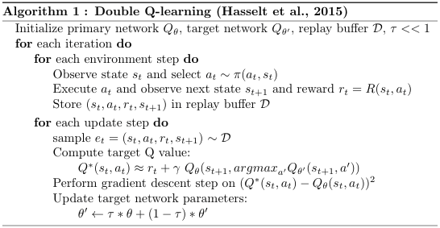

#Usage

There is a requirements.txt file to allow for easy addition of the packages used. 

if they do not work they packages you will need are
- gym (OpenAiGym) speficically the CartPole-v1
- numpy
- PyTorch

It able to be ran from the command line using

py main.py

if you want to use the pretrained model there is a saved checkpoint. It is possible to load it by using 

:> py main.py --checkpoint trained-q

##Information

The model is a Double Q-Learning model. It uses the Basic Q-learning model and then expands on the idea. It is 
based on the Double Q-Learning algorithm by Hasselt. 

I have it running 8000 epochs within the CartPole-v1 enviroment. And this generally takes a few hours to do.
So I have it set that if it achieves a large average reward value of 3000 then to save a checkpoint of the
target, online and optimizer state values. This allows for loading in the checkpoint to start off at a better trained model.

The included trained model achieved a score of 3100 and then was saved.